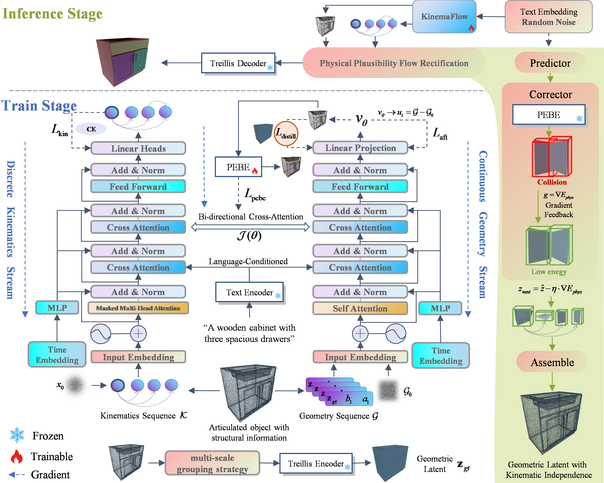
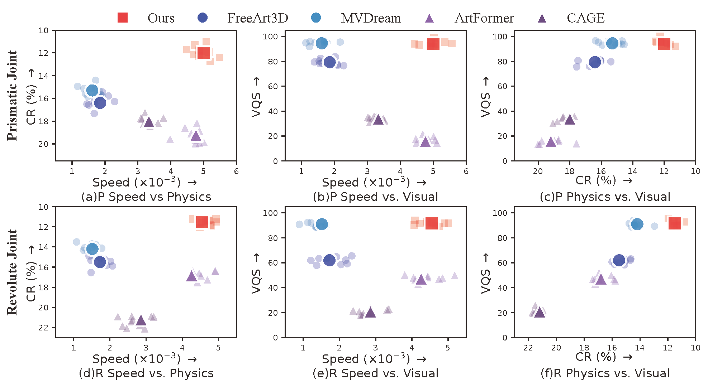
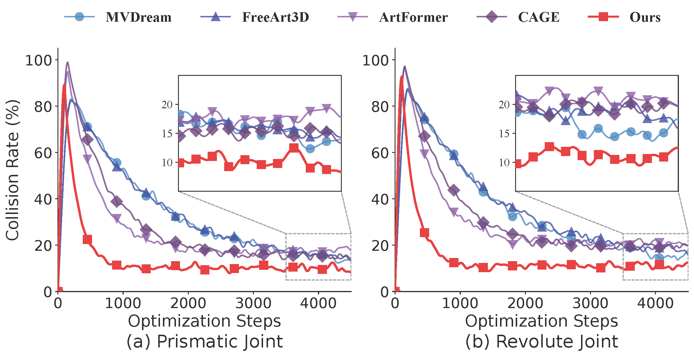
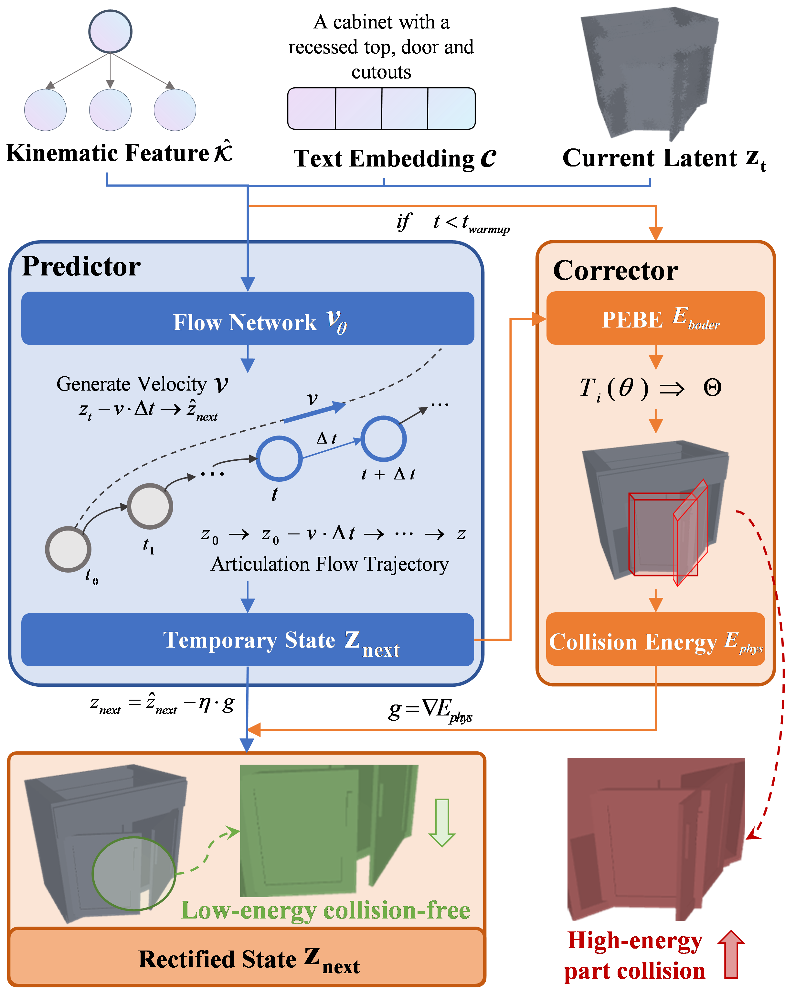
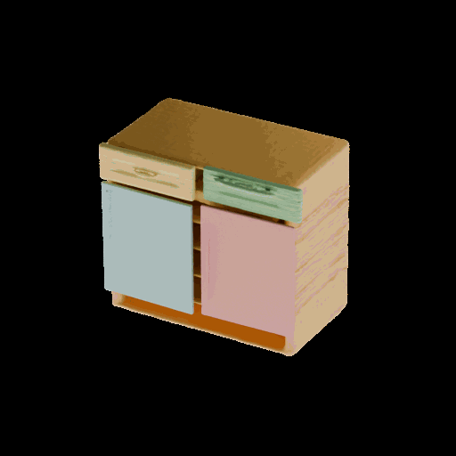
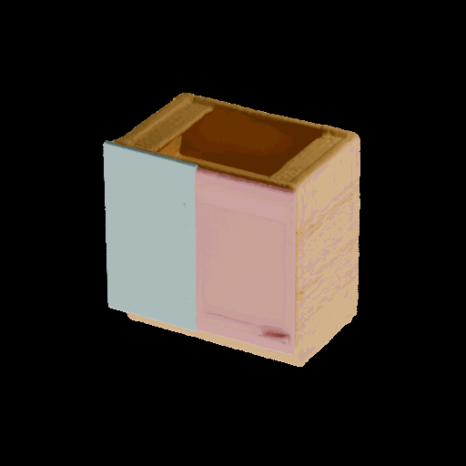
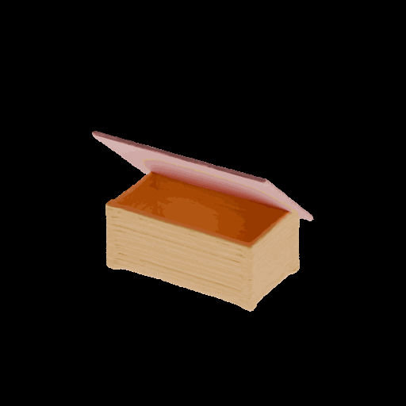
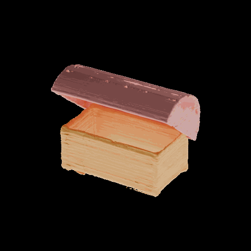
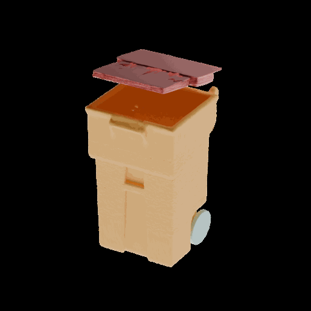

# KinemaFlow: Structured Kinematic Flow Matching for Efficient Articulated Object Generation

<a href="https://opensource.org/licenses/MIT"></a>

**KinemaFlow** is a novel generative framework for efficient and physically plausible 3D articulated object generation. By decoupling generation into a **Kinematics Stream** and a **Geometry Stream** via **Accelerated Flow Matching (AFT)**, we achieve state-of-the-art visual quality with feed-forward throughput of 4.80×10⁻³ samples/s. A **Physical Plausibility Flow Rectification** module further ensures collision-free interactions across the full range of joint motion, reducing dynamic CR to 11.75% on PartNet-Mobility.

<p align="center">
  
  <br><em>Figure 1: Overview of KinemaFlow. Dual-stream hybrid flow matching with TRELLIS-aligned latent distillation and physical plausibility rectification.</em>
</p>

## Key Features

- **Efficient Feed-Forward Inference**: Generates high-fidelity articulated assets via a single forward pass at 4.80×10⁻³ samples/s — a large speedup over SDS-based methods where most of the gain comes from replacing iterative test-time optimization with trained flow matching, while AFT further reduces solver steps within that pipeline.
- **Dynamic Physical Plausibility**: Swept signed-distance energy rectification evaluates collision over a quadrature of articulation states (not a single rest pose), achieving 11.75% dynamic CR on PartNet-Mobility — significantly lower than CAGE (~20%) and ArtFormer (~19%).
- **High Visual Fidelity**: Multi-scale latent distillation from 3D foundation model (TRELLIS) delivers FID 18.29 and CLIP 80.33 on PartNet-Mobility, with sharp geometry (CD 4.71×10⁻³) and realistic textures.
- **Decoupled Architecture**: Separate DiT streams (6-layer for Kinematics, 12-layer for Geometry) synchronized via cross-attention, with joint-type breakdown transparency for Revolute (CR 9.47%) and Prismatic (CR 12.83%) joints.

## Experimental Results

### Quantitative Comparison (Table 1)

We benchmark on PartNet-Mobility (PM) and SN-PN (SN), reporting PM / SN in each cell. CD values are ×10⁻³; CR is dynamic (swept-state) percentage.

| Method | FID ↓ | CLIP ↑ | CD ↓ | CR (%) ↓ |
|--------|-------|--------|------|----------|
| MVDream | 19.63 / 20.45 | 81.82 / 80.56 | 4.68 / 4.84 | 14.75 / 15.68 |
| FreeArt3D | 20.15 / 21.08 | 79.04 / 78.15 | 5.03 / 5.21 | 15.95 / 16.88 |
| CAGE | 23.98 / 25.14 | 77.55 / 76.38 | 6.30 / 6.52 | 19.62 / 20.85 |
| ArtFormer | 23.19 / 24.53 | 73.18 / 72.05 | 5.27 / 5.44 | 18.66 / 19.58 |
| **KinemaFlow (Ours)** | **18.29** / 18.94 | **80.33** / 79.87 | **4.71** / 4.79 | **11.75** / 12.43 |

> FID ↓: lower is better. CLIP ↑: higher is better. CD ↓: ×10⁻³, lower is better. CR (%) ↓: dynamic collision rate over sampled articulation states, lower is better.

### Joint-Type Breakdown

KinemaFlow maintains superior physical plausibility across both joint categories:

| Method | CD (Rev.) ↓ | CR Rev. (%) ↓ | CD (Pris.) ↓ | CR Pris. (%) ↓ |
|--------|-------------|---------------|--------------|----------------|
| MVDream | 4.80 / 4.95 | 14.22 / 15.14 | 4.55 / 4.72 | 15.32 / 16.27 |
| FreeArt3D | 5.15 / 5.33 | 15.58 / 16.52 | 4.90 / 5.08 | 16.74 / 17.59 |
| CAGE | 6.60 / 6.87 | 21.22 / 22.56 | 6.00 / 6.25 | 18.05 / 19.24 |
| ArtFormer | 5.30 / 5.45 | 16.81 / 17.63 | 5.23 / 5.38 | 19.24 / 20.12 |
| **KinemaFlow** | **4.75** / 4.82 | **9.47** / 10.16 | **4.66** / 4.69 | **12.83** / 13.56 |

> On Revolute joints KinemaFlow achieves 9.47% / 10.16% CR compared to baselines >14%, demonstrating the stability enabled by swept-state rectification.

### Multi-Dimensional Trade-offs

<p align="center">
  
  <br><em>Figure 2: Six-panel pairwise trade-off analysis across Prismatic and Revolute joints. Axes: Speed (×10⁻³ samples/s), CR (%), VQS. Top-right is ideal. KinemaFlow (red square) achieves VQS 92.8 at 4.80×10⁻³ samples/s with CR 11.75% — the most favorable overall trade-off.</em>
</p>

<p align="center">
  
  <br><em>Figure 3: Speed vs. visual quality trade-off. KinemaFlow delivers better quality-physics balance at comparable feed-forward throughput to ArtFormer; large speed gap to SDS methods stems from replacing test-time optimization with trained flow matching.</em>
</p>

### Collision Rate Optimization

<p align="center">
  
  <br><em>Figure 4: Dynamic CR optimization on (a) Prismatic and (b) Revolute joints. KinemaFlow (red square) achieves fastest convergence and lowest final CR (~10%) versus baselines. Zoomed insets detail final-phase stability.</em>
</p>

### Ablation Studies (Table 2)

Evaluated on StorageFurniture category of PartNet-Mobility (PM) and SN-PN (SN):

| Configuration | FID ↓ (PM/SN) | CR (%) ↓ (PM/SN) |
|---------------|---------------|-------------------|
| Full KinemaFlow | 18.29 / 18.94 | 11.54 / 12.11 |
| w/o Latent Distillation (no TRELLIS) | 27.33 / 28.45 | 19.60 / 20.03 |
| w/o Rectification | 18.85 / 19.72 | 22.54 / 23.81 |

<p align="center">
  
  <br><em>Figure 5: Ablation visualization. Top: baseline comparisons. Bottom: removing TRELLIS prior (Blue circles — structural distortion, FID spikes to 27.33). Removing rectification (Red circles — severe interpenetration, CR surges to 22.54%). Full model mitigates both.</em>
</p>

**Key findings:**
- Removing latent distillation spikes FID from 18.29 → 27.33 (+49%), confirming TRELLIS prior is essential for visual fidelity.
- Removing swept-state rectification drives CR from 11.54% → 22.54% (+95%), confirming the rectifier is responsible for most of the physical validity gain.
- The trends are consistent across both PartNet-Mobility and SN-PN datasets.

### Inference Efficiency

<p align="center">
  
  
  <br><em>Figure 6: Convergence comparison (linear and log-scale). KinemaFlow reaches high-quality generation with fewer effective flow evaluations than DDPM-based alternatives.</em>
</p>

<p align="center">
  
  
  <br><em>Figure 7: Inference time comparison and distribution. KinemaFlow achieves median ~200s end-to-end with tight variance on a single RTX 4090.</em>
</p>

| Method | Throughput (samples/s ×10⁻³) ↑ | VQS ↑ |
|--------|-------------------------------|-------|
| MVDream | ~0.16 | — |
| FreeArt3D | ~0.19 | — |
| CAGE | ~0.83 | — |
| ArtFormer | **4.49** | — |
| **KinemaFlow (Ours)** | 4.80 | **92.8** |

> KinemaFlow is the first method to occupy the favorable high-VQS, high-throughput corner of the trade-off space. It is only marginally faster than ArtFormer in feed-forward throughput, but delivers substantially better visual quality and physical plausibility.

### Generation Showcase

#### Storage Furniture

<p align="center">
  
  
  <br><em>Storage furniture with functional hinged doors, drawers, and shelves. Articulated motion respects joint limits with collision-free trajectories.</em>
</p>

#### Box / Container

<p align="center">
  
  
  <br><em>Containers with hinged lids. Geometric detail preserved through TRELLIS-aligned latent distillation.</em>
</p>

#### Trash Can

<p align="center">
  
  <br><em>Trash cans with swing lids and pedal mechanisms. Revolute joints show stable 9.47% CR.</em>
</p>

> Full benchmark: 55 test objects across Box (4), StorageFurniture (31), TrashCan (18) on PartNet-Mobility 70/10/20 split. All generation samples, per-category metrics, and input prompts available in `Sample/` directory.

## Physical Plausibility Flow Rectification

The rectification module (Sec. 3.3) implements three components:

| Component | Description | Eq. |
|-----------|-------------|-----|
| **PEBE** | Part Energy Boundary Encoder — predicts oriented quadratic SDF primitives `{(μ_k, S_k, ε_k)}` from geometric latent code | Eq. 5–6 |
| **SweptCollisionEnergy** | Pairwise collision energy `E_ij` over quadrature articulation states (closed, open, midpoint, intermediates) | Eq. 7–8 |
| **PhysicalRectifier** | Predictor-corrector `x̂ = x − γ∇E_phys(x)` applied during early/middle flow matching steps (γ=1.5, first 80% of denoising) | Eq. 9 |

Overhead: ~0.15 GFLOPs / step (<4% of total) on RTX 4090.

## Installation

Tested on Ubuntu 20.04 with Python 3.10 and PyTorch 2.3+ (CUDA 12.1).

```bash
git clone https://github.com/BruceRichard/kinematic_flow.git
cd KinemaFlow

# Create environment
conda env create -f env.yaml
conda activate artformer

# Build custom CUDA kernels
cd utils/z_to_mesh/utils/libmcubes && python setup.py build_ext --inplace && cd -
cd utils/z_to_mesh/utils/libsimplify && python setup.py build_ext --inplace && cd -

# Optional: Install Blender 4.2.2 for GIF rendering → place in 3rd/blender-4.2.2-linux-x64/
```

## Data Preparation

1. Download [PartNet-Mobility](https://sapien.ucsd.edu/downloads) → `data/datasets/0_raw_dataset/`
2. Run preprocessing pipeline (6 stages):

```bash
# Stage 1: Extract meshes + kinematic info from raw PartNet
python data/process_data_script/1_extract_from_raw_dataset.py

# Stage 2: SDF samples for VAE
python data/process_data_script/2.1_generate_gensdf_dataset.py
python data/process_data_script/2.2_generate_diff_dataset.py

# Stage 3: Text descriptions (LLM-assisted)
python data/process_data_script/3.0_generate_text_used_image.py
python data/process_data_script/3.1_generate_text_condition.py
python data/process_data_script/3.2_generate_encoded_text_condition.py

# Stage 4: GT latent codes (frozen TRELLIS backbone)
python data/process_data_script/5_generate_text_transformer_dataset.py
python data/process_data_script/6_generate_gt_dat_info.py
```

## Training (3 Stages)

Configs in `configs/`. Trained on 8× RTX 4090 for 10K epochs.

| Stage | Script | Key Config | Output |
|-------|--------|------------|--------|
| 1: Geometry VAE | `train_stage1_vae.py` | `configs/stage1_vae/train.yaml` | 768-dim TRELLIS-aligned latents |
| 2: Geometry Flow | `train_stage2_geometry_flow.py` | `configs/stage2_geometry/train_with_flow_matching.yaml` | Flow matching + DDPM hybrid |
| 3: Kinematics Net | `train_stage3_kinematics.py` | `configs/stage3_kinematics/text-train.yaml` | 6-layer DiT transformer |

### Training Variants

| Config | Description |
|--------|-------------|
| `text-train.yaml` | Full model with shape prior |
| `text-train-without-shape-prior.yaml` | Ablation: no geometry prior |
| `text-train-without-TPE.yaml` | Ablation: no text-position encoding |
| `image-train.yaml` | Image-conditioned variant |

## Inference

```bash
# End-to-end generation with physical rectification
python inference.py \
    --config configs/stage3_kinematics/text-eval.yaml \
    --prompt "A wooden storage cabinet with two hinged doors" \
    --rectification_scale 1.5

# Interactive demo
python run_demo.py --config configs/stage3_kinematics/text-eval.yaml

# Animate results
python viz_animate.py --input outputs/demo/result.dat --output result.gif
```

| Parameter | Default | Description |
|-----------|---------|-------------|
| `--rectification_scale` | 1.5 | γ in Eq. 9 (0 = disable) |
| `--disable_rectification` | False | Disable physical correction |
| `--steps` | 5000 | ODE solver steps |

## Evaluation

### Full Metric Suite

```bash
# Collision Rate (dynamic, swept-state, n=10 quadrature states)
python evaluate_metrics.py --pred_dir outputs/ --gt_dir dataset/test/ --n_states 10

# Instantiation Distance (pairwise CD matrix)
bash eval/compute_id.sh
```

### Metric Definitions

| Metric | Paper Ref. | Range | Direction |
|--------|-----------|-------|-----------|
| FID | Frechet Inception Distance (rendered views) | [0, ∞) | lower |
| CD | Chamfer Distance ×10⁻³ (sampled point clouds) | [0, ∞) | lower |
| CLIP | Text-3D cosine similarity (CLIP ViT-L/14) | [0, 100] | higher |
| VQS | Visual Quality Score (Eq. 11) | [0, 100] | higher |
| CR | Collision Rate % (swept-state, τ=0.05) | [0, 100] | lower |

## Project Structure

```
KinemaFlow/
├── model/
│   ├── geometry_vae/           # Stage 1: VAE encoder/decoder
│   ├── geometry_flow/          # Stage 2: Flow matching, DDPM hybrid
│   │   ├── flow_matching.py    # CFM / OT scheduler
│   │   ├── geometry.py         # Dual-loss training
│   │   ├── diffusion_wapper.py # DDPM core
│   │   └── mini_encoders.py    # Text / Z condition modules
│   ├── kinematics_net/         # Stage 3: 6-layer DiT transformer
│   │   ├── transformer/        # Autoregressive decoder
│   │   ├── eval/               # Inference pipeline (+ rectification)
│   │   └── dataloader/         # Kinematics dataset
│   └── physics_rectifier/      # PEBE + SweptCollisionEnergy + Rectifier
├── configs/                    # Training/eval YAML files
├── data/process_data_script/   # 6-stage preprocessing pipeline
├── utils/                      # Mesh ops, POR CUDA, Blender driver
├── eval/                       # ID matrix, FID, rendering
├── attachment/                 # Figures from paper + sample GIFs
└── train_stage*.py             # Training entry points
```

## License

MIT License.

## Citation

```bibtex
@article{kinemaflow2026,
  title={KinemaFlow: Structured Kinematic Flow Matching for
         Efficient Articulated Object Generation},
  author={Anonymous Author(s)},
  journal={SIGGRAPH Asia 2026},
  year={2026}
}
```
